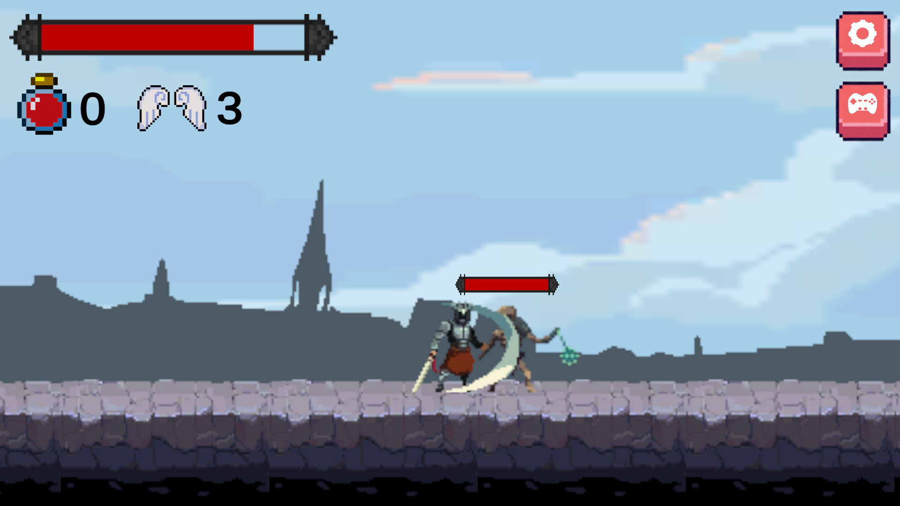
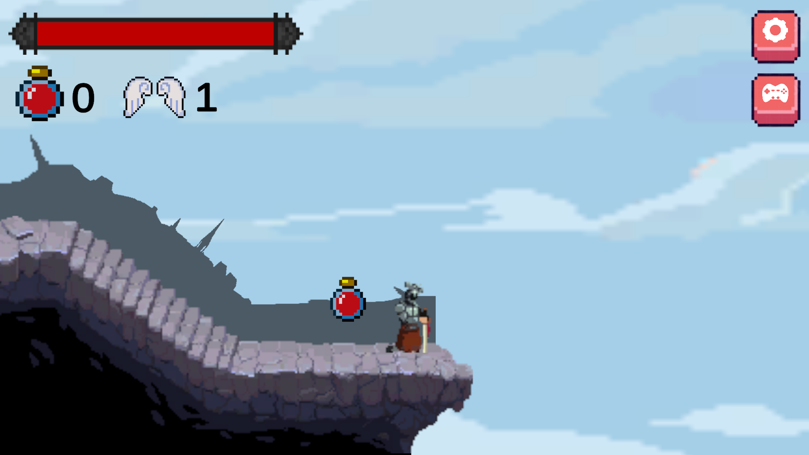
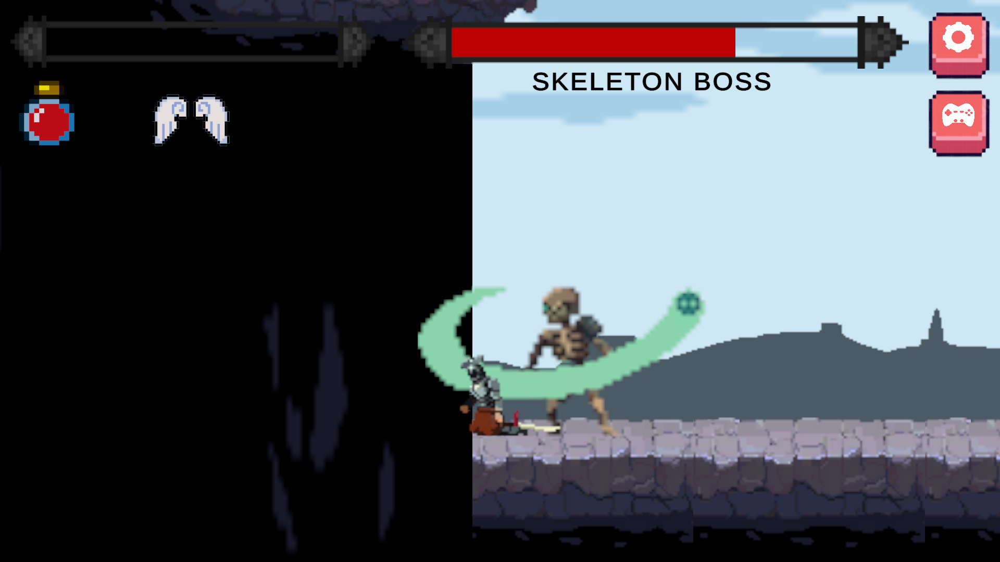

<h1 align="center">Super Knight</h1>

<p align="center">
A 2D pixel-art action platformer developed with Unity and C#.<br>
Control a sword-wielding knight, survive enemy encounters, manage limited healing resources, and defeat the skeleton boss.
</p>

<p align="center">
  
  
  
  
  
  
  
  
  
</p>

---

## Project Overview

**Super Knight** is a 2D side-scrolling action game where the player controls a knight through a dangerous level filled with skeleton enemies and a final boss encounter.

The gameplay loop is built around:

- moving through a pixel-art platformer environment,
- attacking enemies with sword-based combat,
- avoiding enemy hit zones and falling hazards,
- collecting and using elixirs,
- managing a limited number of prayers for partial healing,
- defeating regular enemies before reaching the boss,
- winning by defeating the skeleton boss or losing when the knight's health runs out.







---

## Supported Platform

Super Knight is currently organized as a **PC-focused Unity project**.

- Desktop play with keyboard and mouse controls.
- Unity Editor support through the standard `Assets`, `Packages`, and `ProjectSettings` project structure.
- Compiled builds are not stored in the repository.

---

## Project Structure

```text
Super_Knight/
|-- Assets/
|   |-- Scenes/
|   |   |-- menu.unity
|   |   |-- game.unity
|   |   |-- victory.unity
|   |   `-- defeat.unity
|   |-- screenshots/
|   |   |-- gameplay-1.png
|   |   |-- gameplay-2.png
|   |   `-- gameplay-3.png
|   |-- scripts/
|   |   |-- maincode.cs
|   |   |-- animationcode.cs
|   |   |-- enemy1script.cs
|   |   |-- enemy2script.cs
|   |   |-- enemy3script.cs
|   |   `-- bossscript.cs
|   |-- animations/
|   |   |-- hero/
|   |   |-- enemy1/
|   |   |-- enemy2/
|   |   |-- enemy3/
|   |   |-- boss/
|   |   `-- elixir/
|   |-- movements/
|   |-- places/
|   |-- images/
|   |-- musics/
|   |-- JellyIcons/
|   `-- TextMesh Pro/
|-- Packages/
|-- ProjectSettings/
|-- LICENSE
|-- README.md
`-- .gitignore
```

---

## Core Systems

### Player Movement

- Side-scrolling movement with left and right input.
- Jumping with ground-state checks.
- Rolling while moving.
- Camera follow behavior centered around the knight.
- Fall detection that sends the player to the defeat scene.

### Combat System

- Two mouse-based sword attacks.
- Running attack animation support.
- Temporary attack hit zone used to damage enemies.
- Enemy and boss hit zones that reduce player health on contact.
- Hurt and death animation flow based on player health.

### Health and Resources

- Health bar controlled through Unity UI image fill values.
- Three prayers available per run.
- Each prayer restores part of the player's health.
- Elixir pickup interaction with an on-screen `F` key prompt.
- Stored elixirs can be consumed later to restore health.

### Enemy Encounters

- Three skeleton enemies placed across the level.
- Patrol movement within defined ranges.
- Player detection based on horizontal positioning.
- Attack timing handled through short active hit windows.
- Enemy death animations before removal from the scene.

### Boss Encounter

- Skeleton boss with a separate health bar and animation controller.
- Boss movement and attack behavior triggered during the lower section of the level.
- Boss attacks deal higher damage than regular enemies.
- Defeating the boss loads the victory scene.

### Menu and UI Flow

- Main menu with play and quit actions.
- In-game settings panel.
- Controls panel for key bindings.
- Music and sound effect toggles.
- Victory and defeat scene flow.

---

## Features

### Action Platformer Gameplay

- Keyboard-based movement.
- Mouse-based melee combat.
- Jumping, rolling, basic attacks, secondary attacks, and running attacks.
- Designed around direct timing, positioning, and resource management.

### Resource Management

- Limited prayers encourage careful healing decisions.
- Elixirs must be collected before they can be used.
- Enemy and boss damage make health preservation important throughout the level.

### Complete Game Flow

- Start from the menu.
- Enter the main level.
- Fight through regular enemies.
- Reach and defeat the boss.
- Finish in either the victory or defeat scene.

---

## Game Mechanics

### Attacking

When the player clicks with the mouse, the knight plays an attack animation and briefly activates a hit zone. If an enemy or boss collides with this hit zone, its health is reduced.

### Taking Damage

Regular skeleton attacks reduce the player's health by 20%. Boss attacks reduce the player's health by 40%. When health falls below the survival threshold, the death animation is triggered and the defeat scene is loaded.

### Healing

The player has two healing options:

- **Prayer**: limited-use healing that restores 20% health.
- **Elixir**: collectible item that can be used later for a stronger health restore.

### Winning and Losing

The player wins by defeating the boss. The player loses by running out of health or falling below the playable level area.

---

## How to Play

1. Start the game from the main menu.
2. Move through the level while avoiding enemy attacks.
3. Use sword attacks to defeat skeleton enemies.
4. Collect the elixir when it appears.
5. Use prayers and elixirs carefully to survive.
6. Drop into the boss area and defeat the skeleton boss.

---

## Controls

| Action | Input |
|---|---|
| Move Left | `A` |
| Move Right | `D` |
| Jump | `W` |
| Roll | `S` while moving |
| Basic Attack | Left Mouse Button |
| Secondary Attack | Right Mouse Button |
| Pray | `Left Shift` |
| Pick Up Elixir | `F` |
| Use Elixir | `Enter` |

---

## Technologies Used

- **Unity Engine 2022.3.7f1** - game development engine.
- **C#** - gameplay, combat, UI, scene, and enemy logic.
- **TextMeshPro** - UI text rendering.
- **Unity UI (UGUI)** - health bars, counters, buttons, and menus.
- **Unity Animator** - hero, enemy, boss, elixir, and UI animation states.
- **Unity 2D Physics** - Rigidbody2D movement and collision-based interactions.

---

## Assets and Audio

### Visual Assets

- Pixel-art character, enemy, environment, and background assets are included in the Unity project.
- UI icons and menu button visuals are included under the project assets.

Asset references:

- Character and environment assets: https://drive.google.com/drive/folders/1BywG-FbmgMMcF0Jr-8dpdVC7eiv8Y8NA
- UI icons: https://www.shutterstock.com/tr/image-vector/interface-menu-buttons-pixel-art-set-2216846203

### Audio

- Music and sound effects are included under `Assets/musics/`.
- Sword, hurt, enemy, death, and gameplay audio clips are used during combat and UI flow.

Audio source:

https://assetstore.unity.com/packages/audio/sound-fx/rpg-essentials-sound-effects-free-227708

### Voice

- Knight voice clips: **A. Furkan ÖCEL**

---

## Installation and Play

1. Clone the repository:

```bash
git clone https://github.com/KayzerFurkan04/Super_Knight.git
```

2. Open the project folder with Unity Hub:

```text
Super_Knight
```

3. Use **Unity 2022.3.7f1** or a compatible Unity 2022.3 LTS version.

4. Open the menu scene:

```text
Assets/Scenes/menu.unity
```

5. Press **Play** in the Unity Editor.

### Builds

Compiled game builds are not stored in the source repository. Release builds should be distributed through GitHub Releases, itch.io, or another external download page.

---

## Credits

### Game Development

**A. Furkan ÖCEL**

---

## License

This project is licensed under the terms included in the repository's `LICENSE` file.
